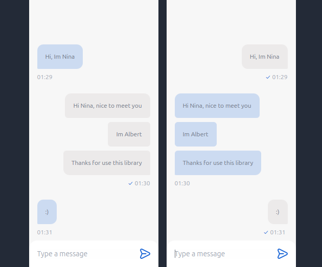

# React UI Chat Examples

This project contains several examples of how to use the `react-ui-chat` library in a React application.

## Examples

### Example 1

[Example1](src/examples/Example1.tsx) shows how to use the basic components of `react-ui-chat`.

### Example 2

[Example2](src/examples/Example2.tsx) shows how to handle the chat updating only a simple last message.

### Example 3

[Example3](src/examples/Example3.tsx) shows how to handle chat events, such as sending and receiving ALL messages.

### Example 4

[Example4](src/examples/Example4.tsx) shows how to integrate `react-ui-chat` with a real-time chat server using the [ChatIo](src/examples/Example4/ChatIo.tsx) component prepaid with socket.io-client.

## How to run the examples

1. Clone this repository.
2. Install the dependencies with `npm install`.
3. Run the project with `npm run dev`.

Open [http://localhost:3000](http://localhost:3000) to view it in the browser.

## Documentation

For more information on how to use `react-ui-chat`, check out the [official documentation](https://link-to-react-ui-chat-docs).
